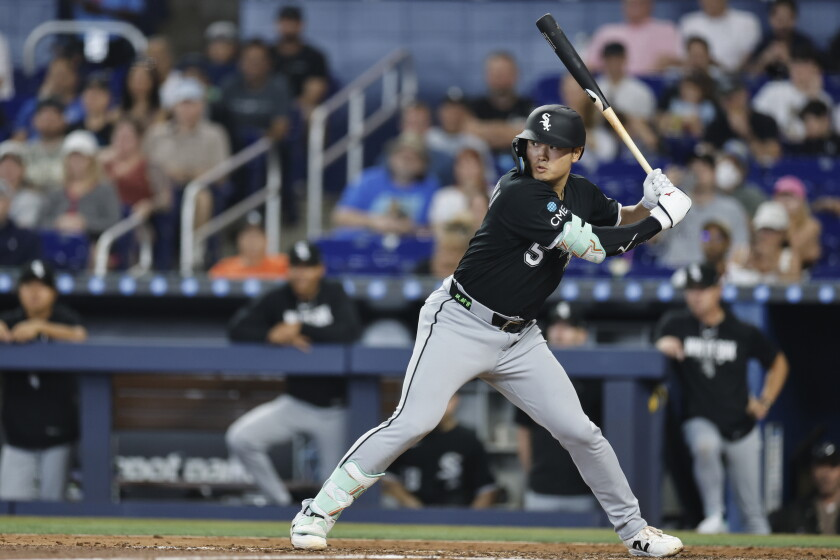
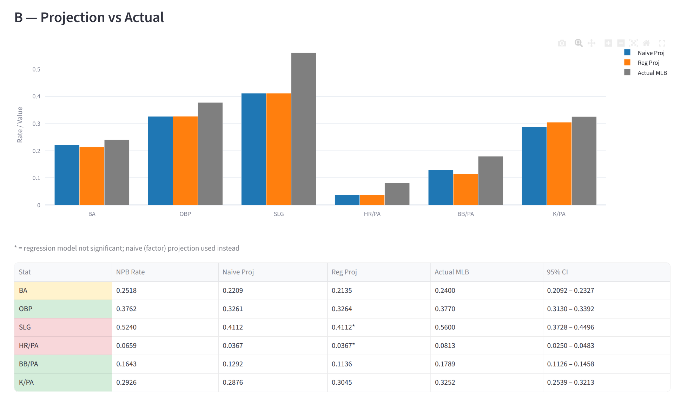

# NPB → MLB Translation Model



A data-driven framework for projecting how Nippon Professional Baseball (NPB) players will perform after crossing over to Major League Baseball. Built to investigate why traditional scouting systematically misjudges NPB talent — and which statistics actually predict success.

**[Live Dashboard →](https://npb-mlb-translation-amzgrhzuzfjcbqzxeoectg.streamlit.app/)** 

---

## Motivation

The 2026 season offers a sharp contrast in NPB-to-MLB transitions: Munetaka Murakami, widely doubted by scouts for his contact ability, is hitting .240/.378/.560 with 20 home runs in his first 57 games. Tatsuya Imai, who commanded a $54M contract on the strength of his scouting reviews, holds a 6.15 ERA through 41 innings. Traditional scouting frameworks — built around raw stuff and eye-test evaluation — keep getting these calls wrong.

This project asks: **which NPB statistics are actually predictive of MLB outcomes, and which ones are noise?**

---

## What This Project Does

A five-phase pipeline that builds a complete NPB→MLB translation framework:

1. **Data Collection** — Scrape NPB and MLB career stats for 27 crossover players from Baseball Reference
2. **Translation Factors** — Derive league-level adjustment factors showing how each stat changes at MLB level
3. **Regression Analysis** — Identify which NPB stats are statistically predictive of MLB performance
4. **Validation** — Test projections against recent crossover players (Murakami, Senga, Yamamoto, Imai)
5. **Dashboard** — Interactive Streamlit app for player lookup and custom projections

---

## Key Findings

### Plate Discipline Translates. Power Does Not.

**Hitting translation factors** (NPB × factor = projected MLB):

| Stat | Factor | 95% CI | Predictive? |
|------|--------|--------|-------------|
| K_rate | 0.983 | [0.868, 1.098] | ✅ R²=0.77, p=0.003 |
| BB_rate | 0.787 | [0.685, 0.888] | ✅ R²=0.64, p=0.005 |
| OBP | 0.867 | [0.832, 0.902] | ✅ R²=0.57, p=0.012 |
| BA | 0.877 | [0.831, 0.924] | ✅ R²=0.43, p=0.042 |
| HR_rate | 0.556 | [0.379, 0.733] | ❌ R²=0.41, p=0.479 |
| SLG | 0.785 | [0.712, 0.858] | ❌ R²=0.27, p=0.793 |

Strikeout rate (R²=0.77) and walk rate (R²=0.64) are the most portable skills from NPB to MLB. A hitter's plate discipline identity carries over reliably. Power — HR rate and SLG — shows moderate translation factors but the NPB numbers are statistically insignificant predictors of MLB power output once age is controlled for.

**Pitching translation factors:**

| Stat | Factor | 95% CI | Predictive? |
|------|--------|--------|-------------|
| K/9 | 0.988 | [0.912, 1.064] | ✅ R²=0.77, p=0.001 |
| ERA | 1.527 | [1.290, 1.763] | ❌ R²=0.10, p=0.484 |
| WHIP | 1.116 | [0.996, 1.236] | ❌ R²=0.07, p=0.732 |
| BB/9 | 1.462 | [1.180, 1.745] | ❌ R²=0.04, p=0.536 |
| HR/9 | 2.408 | [1.595, 3.222] | ❌ R²=0.09, p=0.438 |

Strikeout rate is the only pitching metric that translates reliably (R²=0.77, nearly 1:1). ERA is structurally unpredictable from NPB numbers alone. Age is a significant covariate for K/9 — younger pitchers maintain their stuff better in the transition (age coefficient: -0.209, p=0.026).

### The Murakami Case Study

The model would have told scouts: his walk rate and OBP project as above-average in MLB. His NPB BB_rate of 0.164 — well above the sample mean — is precisely the kind of signal our regression identifies as highly portable (R²=0.64). Scouts anchored on his HR projections (wide CI, statistically insignificant predictor) and discounted his plate discipline (tight CI, strong predictor). The data says that was the wrong trade-off.

---

## Dataset

- **28 players** total: 24 core (training), 4 validation
- **Core sample:** 11 hitters, 13 pitchers with meaningful NPB and MLB seasons
- **NPB data:** 105 hitting season-rows, 134 pitching season-rows (pre-MLB only)
- **MLB data:** 69 hitting season-rows, 92 pitching season-rows
- **Era:** 1990–2026 (Nomo through Murakami/Imai)
- **Source:** Baseball Reference (scraped via BeautifulSoup)

---

## Validation Results

Tested against out-of-sample players not used in model training:

**Hitters:**
| Player | Naive MAE | Notes |
|--------|-----------|-------|
| Seiya Suzuki | 0.021 | Cleanest validation — 4 full MLB seasons |
| Shohei Ohtani | 0.023 | In-sample sanity check |
| Munetaka Murakami | 0.058 | Partial 2026 season (246 PA) |

**Pitchers:**
| Player | Naive MAE | Notes |
|--------|-----------|-------|
| Kodai Senga | 0.223 | Injury-limited MLB sample |
| Yoshinobu Yamamoto | 0.404 | Outperformed projections |
| Shohei Ohtani | 0.443 | In-sample sanity check |
| Tatsuya Imai | 1.049 | Tiny sample (41 IP), ERA blowout |

The naive translation factor approach is competitive with OLS regression for out-of-sample pitchers. The regression model's age penalty on K/9 misfires for seasoned starters like Senga and Yamamoto who debuted in their late 20s.

---

## Project Structure

```
npb-mlb-translation/
├── data/                          # gitignored — regenerated by scripts
│   ├── npb_mlb.db                 # SQLite database (all tables)
│   ├── npb_hitting_stats_raw.csv
│   ├── npb_hitting_stats_clean.csv
│   ├── mlb_hitting_stats_raw.csv
│   ├── mlb_pitching_stats_raw.csv
│   ├── npb_pitching_stats_raw.csv
│   ├── npb_pitching_stats_clean.csv
│   ├── mlb_pitching_stats_raw.csv
│   ├── player_ratios_hitting_v2.csv
│   ├── player_ratios_pitching_v2.csv
│   ├── translation_factors_hitting_v2.csv
│   ├── translation_factors_pitching_v2.csv
│   ├── regression_results_hitting.csv
│   ├── regression_results_pitching.csv
│   ├── validation_results_hitting.csv
│   └── validation_results_pitching.csv
├── scripts/
│   ├── scrape_npb_stats.py        # Phase 1: scrape NPB stats from BBref register
│   ├── scrape_mlb_stats.py        # Phase 1: scrape MLB stats from BBref player pages
│   ├── clean_npb_stats.py         # Phase 1: clean and load into SQLite
│   ├── fetch_mlb_stats.py         # Phase 1: alt MLB fetcher (FanGraphs — blocked by 403)
│   ├── compute_translation_factors.py  # Phase 2: per-player ratios + league factors
│   ├── winsorize_and_refine.py    # Phase 2: winsorize outliers + confidence intervals
│   ├── regression_analysis.py     # Phase 3: OLS regressions + LOO-CV
│   └── validation_analysis.py     # Phase 4: validate against recent crossovers
├── dashboard.py                   # Phase 5: Streamlit app
├── npb_mlb_player_list.csv        # Manually curated crossover player list
├── requirements.txt
├── .gitignore
└── README.md
```

---

## Reproducing the Pipeline

```bash
# 1. Install dependencies
pip install -r requirements.txt

# 2. Fill in REGISTER_ID_MAP in scrape_npb_stats.py (see script comments)
#    then scrape NPB stats (~2 min, 4s delay between requests)
python scripts/scrape_npb_stats.py

# 3. Scrape MLB stats
python scripts/scrape_mlb_stats.py

# 4. Clean and load into SQLite
python scripts/clean_npb_stats.py

# 5. Compute translation factors
python scripts/compute_translation_factors.py

# 6. Winsorize and add confidence intervals
python scripts/winsorize_and_refine.py

# 7. Run regression analysis
python scripts/regression_analysis.py

# 8. Validate against recent crossover players
python scripts/validation_analysis.py

# 9. Launch dashboard
streamlit run dashboard.py
```

> **Note:** `fetch_mlb_stats.py` is included for reference but is non-functional due to FanGraphs returning 403 errors for automated requests. MLB stats are scraped from Baseball Reference instead via `scrape_mlb_stats.py`.

---

## Limitations

- **Sample size:** 11 hitters and 13 pitchers is a thin training set. Results should be interpreted as directional rather than precise.
- **Era effects:** The dataset spans 1990–2026. The NPB-to-MLB gap may have narrowed as scouting and player development have globalized.
- **No pitch-level data:** NPB lacks Statcast-equivalent tracking, so spin rate, velocity, and movement data — potentially strong translators — are unavailable.
- **Power is unpredictable:** HR rate and SLG have wide confidence intervals and the NPB predictor is not statistically significant. Use those projections with caution.
- **ERA is structural noise:** NPB ERA does not predict MLB ERA. Defense, park factors, and bullpen usage make run prevention metrics highly context-dependent.

---

## Tech Stack

- **Python** — pandas, numpy, statsmodels, BeautifulSoup, sqlite3
- **Streamlit** — interactive dashboard
- **Plotly** — charts and gauges
- **SQLite** — local database for all project tables
- **Data source** — [Baseball Reference](https://www.baseball-reference.com)

---

## Author

Wing Lai | UC Davis  
[GitHub](https://github.com/wilai3) · [LinkedIn](https://www.linkedin.com/in/wing-lai-7a8987271/)

---

*Data sourced from Baseball Reference. This project is for educational and portfolio purposes.*
